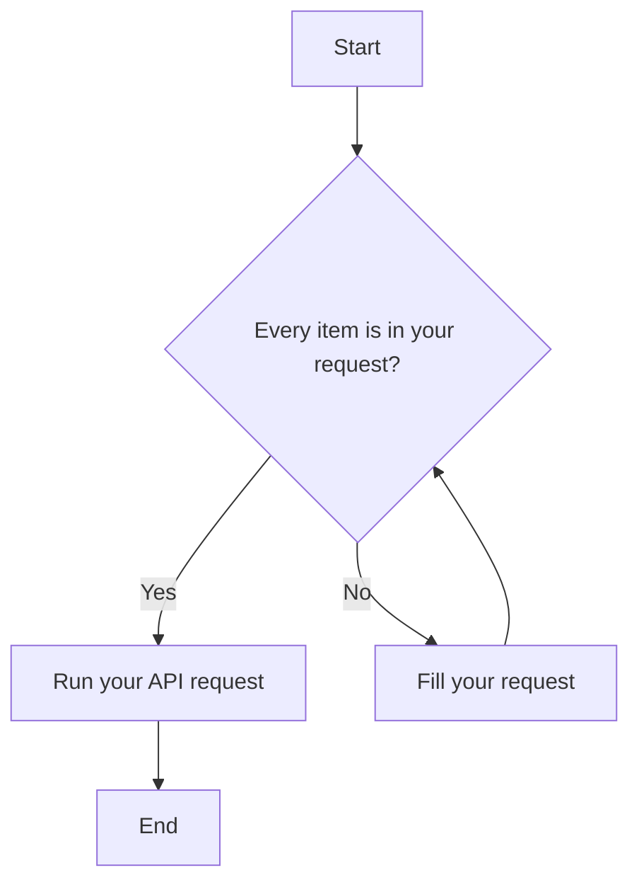

## About 

This project was created by my own as a final project in one of study programs, which name is "Data Science full course".

## Files

### Final
The notebook "final" is the whole completed work. Here you can find all steps collected in one big file.

### API
File _"api.py"_ contains an api service (as the main executor of a model). Its service realization was made in _"service.py"_ file.
In file _"instruction.txt"_ you can find the Russian instruction how to use api service.

### pickles
In _'model'_ folder you can find .pkl files of the model and its transformers.

### Additional
We also have an additional file with business notes about the model, which was created in Russian.

## API instruction

### How to use API

#### API instruments

**For API running** use uvicorn
```bash
pip install 'uvicorn[standard]'
uvicorn main:app --reload
```

**For API exploiting** use postman or localhost in your browser (OR your own variant) 
[Local host](http://127.0.0.1:8000/)
[P0stman](https://www.postman.com/)

[](https://www.postman.com/)

#### API commands

1. ***/status*** - status check. If u got 200, everything is up (GET).
2. ***/metadata*** - meta-data output (GET).
3. ***/predict*** - prediction. 0 - no target action is awaited. 1 - a target action is awaited (POST).
4. ~~/predict_proba~~ - probability output (POST).

### Requests' body

| Field | Type | Description | Example |
| :--- | :--- | :--- | :--- |
| `visit_datetime` | `str` | Date and time of the visit (ISO 8601) | `2024-03-22 19:00:00` |
| `visit_number` | `int` | Sequential identifier for the visit | `19` |
| `geo_city` | `str` | City from which the visit originated | `Moscow` |
| `utm_medium` | `str` | UTM medium — traffic source or channel | `referral` |
| `device_category` | `str` | Category of the device used | `smartphone` |
| `device_browser` | `str` | Browser or app used to access the site | `Telegram` |
| `brand` | `str` | Manufacturer brand of the device | `Apple` |

> All items from the table are required \#everything
-----

